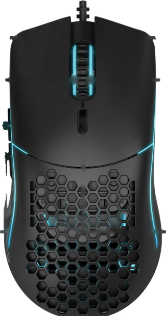
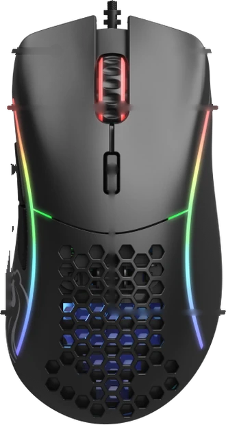
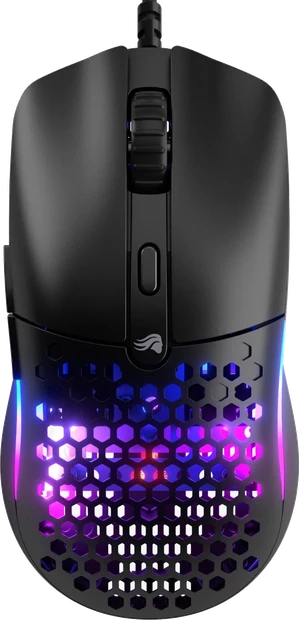

# MouseFlash

Configure your Glorious mouse from a web page. No driver, no install, no Windows
virtual machine.

MouseFlash talks to the mouse over WebHID and writes settings to its onboard
flash, so they follow the mouse to any computer.

**[Open MouseFlash](https://mason363.github.io/MouseFlash/)**

  

## What it does

- **Buttons.** Remap all six buttons to a mouse click, a scroll step, a keyboard
  shortcut, a media key, a DPI action, rapid fire, or a macro.
- **DPI.** Eight stages, each one on or off, with its own value, indicator
  colour, and optionally separate X and Y.
- **Macros.** Record key presses and releases with their real timing, edit the
  delays, and write them to one of the eight onboard slots.
- **Lighting.** Every effect the mouse has, with its speed, brightness, and colours.
- **Polling rate, debounce, and lift-off distance.**
- **Backup.** Export the raw reports to a JSON file and restore them later.

## Requirements

A Chromium browser on desktop: Chrome, Edge, Opera, Brave, Arc, or similar.
WebHID is what makes this possible and Firefox and Safari do not implement it,
so they cannot run MouseFlash. The page must be served over HTTPS or from
localhost, which is a WebHID requirement rather than a MouseFlash one.

## If the browser cannot open the mouse

These mice put their settings on the same USB interface as a keyboard collection,
which is what lets a button send a keyboard shortcut. Any program that claims
keyboards claims that interface too, and then nothing else can open it. The
browser reports this only as "Failed to open the device".

- **Another MouseFlash tab.** Only one can hold the mouse at a time, and
  MouseFlash reconnects on load, so a second tab left open will block the first.
  Close the others and reload.
- **macOS.** Otherwise usually [Karabiner-Elements](https://karabiner-elements.pqrs.org/),
  which seizes every device it sees as a keyboard. Open its settings, go to
  Devices, and untick the mouse. Quitting Karabiner works too. Other remappers
  that grab HID devices do the same thing.
- **Windows.** Close the vendor software, such as Glorious CORE.
- **Linux.** Check that nothing else holds the hidraw node, and that your user
  has permission to read it. A udev rule is usually what is missing.

## Supported mice

These mice are known to speak this protocol, on the authority of the projects
listed under Credits. MouseFlash recognises them by name and knows how many
buttons each has. The three Glorious models are shown with real product
photography; the rest fall back to a generic drawing.

| Mouse | USB ID |
| --- | --- |
| Glorious Model O / O- | `258a:0036`, `258a:0027` on early firmware |
| Glorious Model D / D- | `258a:0033` |
| Glorious Model O Eternal | `3794:a000` |
| Dream Machines DM5 Blink | `258a:0027` |
| G-Wolves Hati HT-M Wired | `258a:0027` |
| Genesis Xenon 770 | `258a:0027` |
| Machenike M620 | `258a:0029` |
| Mad Dog GM905 | `258a:0029` |
| T-Dagger Imperial T-TGM310 | `258a:0051` |
| Marvo Scorpion G961 | `258a:1007` |

Several of these share a USB product ID and are told apart by the firmware
version string, which MouseFlash reads and shows.

To be clear about what has actually been exercised on hardware: the encoder is
covered by a test suite that checks it against the documented byte sequences, and
the full read, edit, and write path has been run against a simulated device. Real
hardware confirmation is per mouse, and reports are welcome.

Other mice on the same SinoWealth controller stand a good chance of working.
MouseFlash reads the sensor type and the configuration size off the mouse rather
than assuming them, so it adapts to a device it has never seen. It says plainly
when it does not recognise one. If you try an unlisted mouse, opening an issue
either way is useful.

Battery and wireless features are not supported. The protocol here is the wired
configuration interface.

## Before you save anything

Saving writes to the mouse's onboard flash. This is what the vendor software
does too, but MouseFlash is not vendor software and the protocol was worked out
by reverse engineering rather than published by anyone. There is some chance a
write leaves the mouse in a state you did not want.

Two things reduce the risk, and they are worth knowing about:

- MouseFlash never builds a report from scratch. It reads what the mouse has,
  changes only the bytes it understands, and writes everything else back
  untouched. Unknown bytes survive a round trip unchanged, which the test suite
  checks.
- Where an implementation is known to misbehave, MouseFlash declines rather than
  guessing. A lift-off distance of `0xff` means the mouse manages it through a
  separate command, so the control is disabled instead of overwritten.

Buttons and DPI are the best understood parts. Lighting and lift-off distance
are less so. Export a backup from the Settings tab before your first save.

## Running it locally

There is no build step and no dependencies. Serve the folder over HTTP:

```bash
python3 -m http.server 8000
```

Then open `http://localhost:8000`. Opening `index.html` as a file will not work,
because WebHID needs a secure context.

To run the protocol tests:

```bash
node --test test/protocol.test.mjs
```

## How it works

The mouse presents several HID collections. One of them uses a vendor-defined
usage page, and that is the one carrying the settings. Chromium blocks the mouse
and keyboard collections on the same device from reaching a web page, so
MouseFlash can write configuration but cannot read what you type or where you
click. Settings go in and out through HID feature reports.

[docs/PROTOCOL.md](docs/PROTOCOL.md) documents the whole layout: report IDs,
every byte of the configuration structure, the button action encodings, the
macro event format, and the sensor-dependent DPI encoding.

The code is four small modules with no framework:

| File | Purpose |
| --- | --- |
| [js/protocol.js](js/protocol.js) | encoding and decoding, pure byte shuffling |
| [js/hid.js](js/hid.js) | WebHID transport |
| [js/devices.js](js/devices.js) | known mice and sensors |
| [js/app.js](js/app.js) | the UI |

## Credits

MouseFlash implements a protocol other people worked out. It exists because of:

- **[enkore/gloriousctl](https://github.com/enkore/gloriousctl)**, the original
  reverse engineering of the Model O and D configuration protocol.
- **[outfoxxed/glorious-mouse-control](https://github.com/outfoxxed/glorious-mouse-control)**,
  whose [`packet_spec.md`](https://github.com/outfoxxed/glorious-mouse-control/blob/master/packet_spec.md)
  documents the packets sniffed from the official software. MIT.
- **[sammko/gloryctl](https://github.com/sammko/gloryctl)**, a Rust implementation
  covering button mapping and macros. MIT.
- **[libratbag](https://github.com/libratbag/libratbag)** and its `sinowealth`
  driver, the most complete treatment of the format, including the variable
  configuration size, the sensor table, and the device list. MIT.

### Artwork

The photographs in `assets/mice/` are Glorious' own product images, taken from
the button guides on their support pages and cut out of their backgrounds. They
are used to identify the hardware the tool configures. They are **not** covered
by this repository's licence and remain the property of Glorious. If Glorious
would rather they were not here, open an issue and they will be removed.

`assets/mouse-diagram.svg` is a drawing made for this project, covered by the
repository licence. It is what the app shows for any mouse there is no
photograph of.

### On licensing

MouseFlash is MIT licensed, and that was checked rather than assumed.

`gloriousctl` is under the EUPL 1.2, a copyleft licence that a derivative work
could not simply relicense as MIT. MouseFlash is not derived from its code. The
implementation here follows `packet_spec.md`, `gloryctl`, and libratbag, all
three MIT licensed, and those three cover everything MouseFlash needs.
`gloriousctl` was read only to cross-check facts about the protocol, and the
facts of a wire format are not themselves copyrightable. It is credited first
regardless, because without it none of the others would exist.

If you believe this reading is wrong, please open an issue and the licence will
be changed.

## Licence

MIT. See [LICENSE](LICENSE).

MouseFlash is not affiliated with, endorsed by, or connected to Glorious or
SinoWealth. Using it may well void your warranty.
