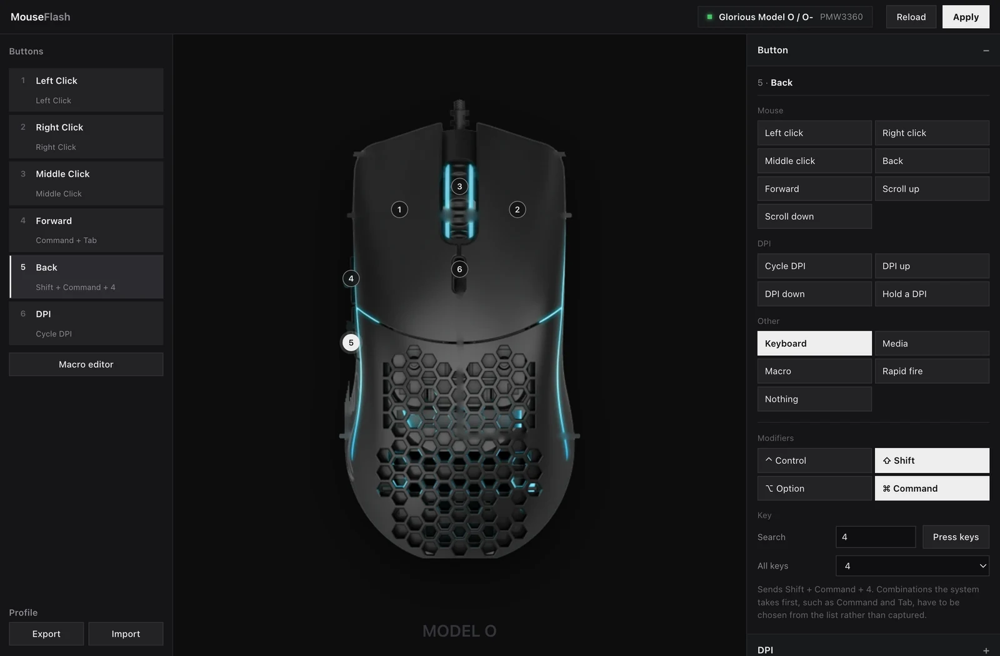

# MouseFlash

Configure your Glorious mouse in the browser. No driver, no install, no Windows.

Settings are written to the mouse's onboard memory, so they follow it to any computer.

**[Open MouseFlash](https://mason363.github.io/MouseFlash/)**



  

## Features

- **Buttons.** Pick an action from a grid, or drag it onto the button in the photo. Clicks, scroll, keyboard shortcuts, media keys, DPI actions, rapid fire, macros.
- **Keyboard shortcuts.** Press the combination to capture it, or type to search the key list.
- **DPI.** Eight stages, each with its own value, indicator colour, and optional separate X and Y.
- **Macros.** Record with real timing, reorder by dragging, write to any of the eight onboard slots.
- **Lighting.** Every effect the mouse supports, with speed, brightness and colours.
- **Performance.** Polling rate, debounce, lift-off distance.
- **Backup.** Export and restore everything as a JSON file.

## Supported mice

| Mouse | USB ID |
| --- | --- |
| Glorious Model O / O- | `258a:0036`, `258a:0027` early firmware |
| Glorious Model D / D- | `258a:0033` |
| Glorious Model O Eternal | `3794:a000` |
| Dream Machines DM5 Blink | `258a:0027` |
| G-Wolves Hati HT-M Wired | `258a:0027` |
| Genesis Xenon 770 | `258a:0027` |
| Machenike M620 | `258a:0029` |
| Mad Dog GM905 | `258a:0029` |
| T-Dagger Imperial T-TGM310 | `258a:0051` |
| Marvo Scorpion G961 | `258a:1007` |

The Model O is verified on hardware. The others share the same controller and
protocol. Unlisted SinoWealth mice are worth trying: MouseFlash reads the sensor
and configuration size from the device rather than assuming them.

Wired configuration only. No battery or wireless features.

## Requirements

A Chromium browser on desktop: Chrome, Edge, Brave, Opera, Arc. Firefox and
Safari have no WebHID and cannot run it.

## Troubleshooting

**"Failed to open the device"** means another program has claimed the mouse.
These mice expose their settings on the same USB interface as a keyboard
collection, so anything that grabs keyboards grabs this too.

- Close any other MouseFlash tab. Only one can hold the mouse.
- macOS: key remappers such as Karabiner-Elements seize it. Untick the mouse in
  its Devices settings, or quit it.
- Windows: close Glorious CORE.
- Linux: check nothing else holds the hidraw node and that you have a udev rule.

**Nothing changes after Apply.** Reload the page with Ctrl+Shift+R or Cmd+Shift+R
to clear a cached build.

## Safety

Applying writes to the mouse's onboard memory, the same as the vendor software
does. The protocol is reverse engineered, so export a backup from the Device
panel before your first write.

MouseFlash reads the current settings, changes only the bytes it understands,
and writes the rest back untouched.

## Development

No build step, no dependencies.

```bash
python3 -m http.server 8000
```

Open `http://localhost:8000`. Opening the file directly will not work, because
WebHID needs a secure context.

```bash
node --test test/protocol.test.mjs
```

[docs/PROTOCOL.md](docs/PROTOCOL.md) documents the full wire format: report IDs,
every byte of the configuration structure, button action encodings, macro
events, and the sensor-dependent DPI encoding.

| File | |
| --- | --- |
| [js/protocol.js](js/protocol.js) | encode and decode |
| [js/hid.js](js/hid.js) | WebHID transport |
| [js/devices.js](js/devices.js) | device and sensor tables |
| [js/app.js](js/app.js) | interface |

## Credits

Built on the reverse engineering in
[enkore/gloriousctl](https://github.com/enkore/gloriousctl),
[outfoxxed/glorious-mouse-control](https://github.com/outfoxxed/glorious-mouse-control),
[sammko/gloryctl](https://github.com/sammko/gloryctl) and
[libratbag](https://github.com/libratbag/libratbag).

## Licence

MIT, see [LICENSE](LICENSE). The implementation follows the MIT-licensed sources
above; gloriousctl is EUPL-1.2 and was not copied from.

Product photographs in `assets/mice/` are Glorious' own images and remain their
property. They are not covered by this licence.

Not affiliated with Glorious or SinoWealth. May void your warranty.
